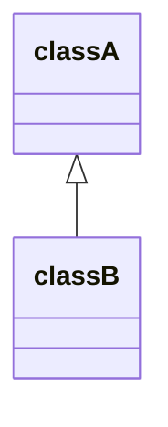

#FLYCORE

Apelidado de "FlyCore" este projeto foi desenvolvido em grupos para a disciplina de "Programação Orientada a Objetos" (POO) cursada na PUC Minas Campus São Gabriel em Belo Horizonte, Minas Gerais, Brasil. 
Os membros do grupo são: 

- Diogo Marques (diogo-oos);

- Esdras (xxx);

- Leonardo Mamede (xLyMzR);

- Lucas Amaral (lucasamaralgh);

-----------------------

No projeto trabalhamos habilidades como:

- Análise voltada para objetos
- Diagramação e Projeto de classes
- Relacionamento entre classes
- Troca de MSG entre objetos
- Programação orientada para objetos

-----------------------
 
OBSERVAÇÕES:

• Trabalho em grupos de 3 ou 4 alunos.  
• Todos  os  artefatos  do  trabalho  devem  ser  hospedados  em  uma  tarefa  do  GitHub  Classroom, 
conforme explicado em aula.  
• O grupo deve criar um Kanban e dar acesso ao professor para acompanhamento dos trabalhos.

CONSIDERAÇÕES DO GRUPO:

• Diagramas serão implementados no README.md e serão feitos utilizando uma linguagem de markdown baseada em javascript chamada Mermaid.
• Link documentação Mermaid: https://mermaid-js.github.io/mermaid/#/

#ETAPAS DO PROJETO:

**1ª Etapa do projeto:** 

a) Criar um diagrama de classes UML que modele corretamente o que foi descrito; 
b) validar o diagrama com o analista sênior; 
c) implementar as classes após a validação.  

O que deve ser produzido: 

• Modelo/diagrama de classes desenvolvido para resolver o problema. Não é necessário incluir 
construtores nem métodos get/set no modelo. 
• Código das classes, de acordo com o diagrama, documentado/comentado. 

-------------------------------------------------------------------

#Diagramas De classe

