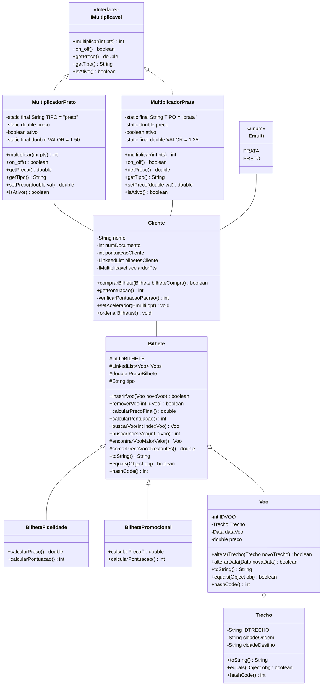

# FLYCORE

Apelidado de "FlyCore" este projeto foi desenvolvido em grupos para a disciplina de "Programação Orientada a Objetos" (POO) cursada na PUC Minas Campus São Gabriel em Belo Horizonte, Minas Gerais, Brasil. 

Os membros do grupo são: 

- Diogo Marques (diogo-oos);

- Esdras (Esdras-Filipe);

- Leonardo Mamede (xLyMzR);

- Lucas Amaral (lucasamaralgh);

No projeto trabalhamos habilidades como:

- Análise voltada para objetos
- Diagramação e Projeto de classes
- Relacionamento entre classes
- Troca de MSG entre objetos
- Programação orientada para objetos

 
Observações:

• Trabalho em grupos de 3 ou 4 alunos.  
• Todos  os  artefatos  do  trabalho  devem  ser  hospedados  em  uma  tarefa  do  GitHub  Classroom, 
conforme explicado em aula.  
• O grupo deve criar um Kanban e dar acesso ao professor para acompanhamento dos trabalhos.

-------------------
# Contexto e Requisitos

 O grupo  de  trabalho  recebeu  a  responsabilidade  de  desenvolver  um  sistema de software de uma companhia aérea fictícia. 
 O sistema se mostra abrangente e de média complexidade,  de  modo  que  a  estratégia  escolhida  foi  a  de  desenvolvimento  por  módulos  que  serão 
integrados cumulativamente. 

**O primeiro passo é entender o funcionamento do sistema aéreo em geral**: 

• Cada trecho de voo da companhia aérea tem associado a si um número único e os aeroportos 
de origem e destino.

• Um voo é um trecho associado a uma data específica. Por exemplo, PUC0726 (Belo 
Horizonte/Barcelona) - em 19/12/2021.

• Um  bilhete  pode  conter  reservas  para  diversos  voos.  Por  exemplo,  um  bilhete  de  viagem  de 
Belo Horizonte para Paris pode ser formado pelos trechos Belo Horizonte/Barcelona e 
Barcelona/Paris. 

-----------------------

# Considerações do grupo

• Diagramas serão implementados no README.md na pasta de diagramas e serão feitos utilizando uma linguagem de markdown baseada em javascript chamada Mermaid.

• Link documentação Mermaid: https://mermaid-js.github.io/mermaid/#/

-----------------------
# Etapas do Projeto

**1ª Etapa do projeto:** 

a) Criar um diagrama de classes UML que modele corretamente o que foi descrito;

b) validar o diagrama com o analista sênior;

c) implementar as classes após a validação.  

O que deve ser produzido: 

• Modelo/diagrama de classes desenvolvido para resolver o problema. Não é necessário incluir 
construtores nem métodos get/set no modelo. 
• Código das classes, de acordo com o diagrama, documentado/comentado. 

-------------------------
# Diagramas de classe

